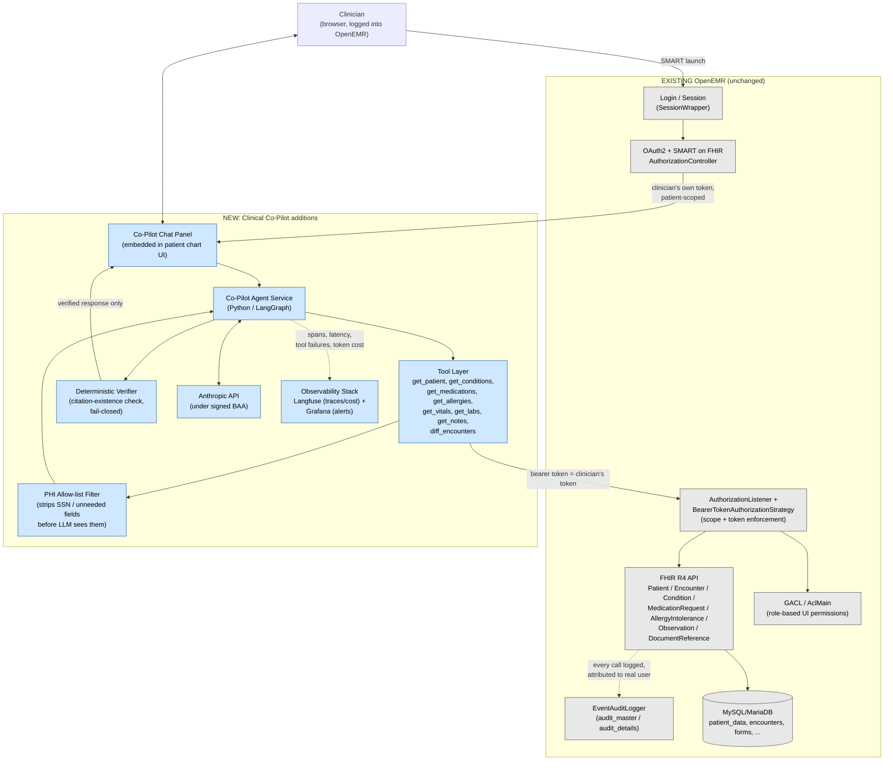
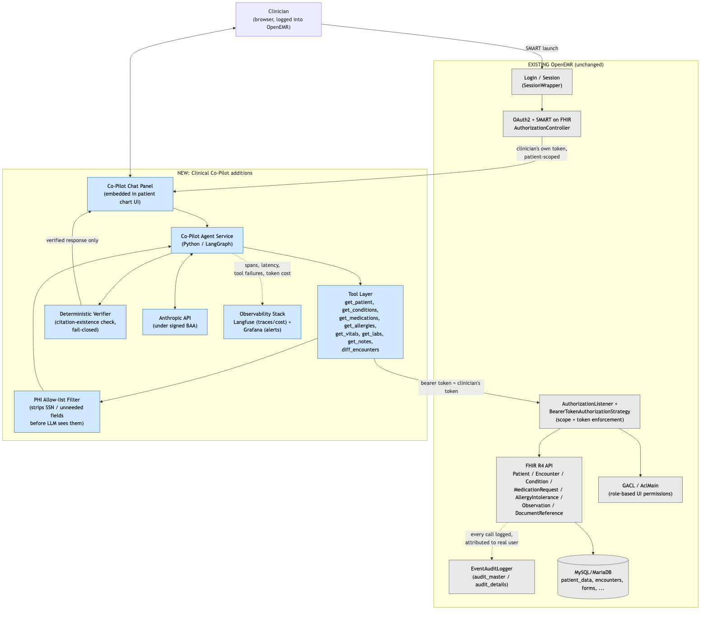

# ARCHITECTURE.md — Clinical Co-Pilot Integration Plan

## TL;DR

- **What it is**: a conversational agent embedded in the patient chart, answering the 6 use cases in `USER.md`
  in the ~90 seconds between patient rooms.
- **Auth**: inherits the logged-in clinician's own OAuth2/SMART-on-FHIR token — no shared credential, no
  reimplemented access control.
- **Trust**: every claim must cite a FHIR resource actually fetched that turn; a deterministic (non-LLM) check
  strips anything uncited or unverifiable before the clinician sees it.
- **Speed**: a fast parallel "core bundle" covers the most time-pressured lookups; deeper questions fetch
  on-demand.
- **Stack**: separate Python/LangGraph service calling OpenEMR's FHIR API over HTTPS, not embedded in OpenEMR's
  PHP codebase.
- **Langfuse Cloud PHI compliance**: trace payloads are redacted in code (no PHI, no bearer token, hashed
  patient ID) before they leave the agent — see `agent/PHI_AUDIT.md`. Full self-hosting is documented as a
  deferred future hardening step in `agent/LANGFUSE_SELFHOST.md`, not required given the redaction in place.

## Summary

The Clinical Co-Pilot is a conversational agent for an ED resident on overnight intake, built to answer the
six use cases in `USER.md` (patient snapshot, what's changed, meds/allergies check, labs/vitals, relevant
history, honest "nothing on file") in the ~90 seconds between patient rooms. Five decisions shape everything
else in this document.

**LLM & BAA.** The agent calls the Anthropic API under a signed Business Associate Agreement. `AUDIT.md`
found zero de-identification capability anywhere in OpenEMR and SSN stored in plaintext — a BAA makes sending
PHI to the model legally permissible, but does not make it safe by default. The tool layer therefore
allow-lists which fields ever leave OpenEMR (Section 4): SSN and other fields no use case needs are never
serialized into a tool result in the first place, satisfying HIPAA's "minimum necessary" standard independent
of the BAA.

**Authorization inheritance, not reimplementation.** The single biggest trust-boundary decision: the agent
never uses a shared service-account credential. It authenticates to OpenEMR's existing FHIR API using the
logged-in clinician's own OAuth2 token (Authorization Code + PKCE, SMART on FHIR launch context), scoped to
the patient whose chart is open. This means OpenEMR's existing enforcement — `AuthorizationListener`,
`BearerTokenAuthorizationStrategy`, per-resource CRUDS scopes — runs on every agent tool call exactly as it
would for a human clicking through the UI. The agent cannot see anything the requesting clinician couldn't
already see, and `AUDIT.md`'s "don't assume all users are trusted" constraint is enforced by OpenEMR itself,
not by agent-side logic that could be wrong or bypassed.

**Deterministic verification, not LLM-graded verification.** Every clinical claim the agent makes must carry a
structured citation (FHIR resource type + id + date) generated at answer time via forced structured output. A
non-LLM verification pass then checks each citation against the actual tool results returned that turn before
the response is released to the user; uncited or unverifiable claims are stripped, not shown. This was chosen
over an "LLM judges its own output" approach because a second model call cannot reliably catch the first
model's hallucination — a code-level check against ground-truth tool output can.

**Speed vs. completeness: a two-tier fetch.** On opening a patient's chart, the agent fires a parallel
"core bundle" (demographics, active problems, active meds, active allergies, latest vitals, last encounter)
against the FHIR API with a hard timeout, since UC-1/UC-3/UC-4 — the most time-pressured lookups — only need
this. Deeper questions (UC-2's diff, UC-5's relevance ranking) are fetched on-demand only when asked, because
they're asked less often and can tolerate an extra second or two. This is the explicit, defensible tradeoff
the assignment requires: optimize the common case for seconds, let the rare case cost a bit more.

**Stack.** A separate Python service (LangGraph) calls OpenEMR's FHIR API over HTTPS rather than living inside
OpenEMR's PHP codebase — this keeps agent logic, its dependency updates, and its own release cycle decoupled
from OpenEMR core, at the cost of an HTTP hop per tool call (acceptable given the latency budget above).

The rest of this document details the tool layer, verification design, observability, tool-failure/missing-
data behavior, and remaining tradeoffs.

---

## 1. System Overview

(Source: `docs/architecture-diagram.mmd` — the Mermaid block above and this PNG are kept in sync; regenerate
the PNG with `npx @mermaid-js/mermaid-cli -i docs/architecture-diagram.mmd -o docs/architecture-diagram.png -b white -s 2`
if the diagram changes.)

The agent is a new, additive layer (blue) sitting entirely on top of OpenEMR's existing auth, ACL, FHIR API,
and audit logging (gray) — none of which is modified. Every tool call rides the clinician's own OAuth2 token
through the existing `AuthorizationListener`/`BearerTokenAuthorizationStrategy` enforcement and lands in the
existing `EventAuditLogger` audit trail, so authorization and audit logging are inherited, not reimplemented.

## 2. Authorization & Trust Boundaries

- **Token scope**: agent requests OAuth2 scopes limited to what its tools need —
  `patient/Patient.read patient/Encounter.read patient/Condition.read patient/MedicationRequest.read
  patient/AllergyIntolerance.read patient/Observation.read patient/DocumentReference.read` — read-only,
  category-filterable per existing OpenEMR scope grammar. No write scopes are requested; the agent cannot
  modify the chart.
- **Session binding**: a Co-Pilot conversation is bound to the `(user_id, patient_id)` pair from the SMART
  launch context and dies with the underlying token (OpenEMR's existing session lifetime, ~4h default). A
  chat opened for Patient A cannot be redirected mid-conversation to answer questions about Patient B — every
  tool call re-sends the same patient-scoped token, so OpenEMR's own API would reject cross-patient reads if
  attempted (this is enforced server-side by OpenEMR, not client-side by the agent).
- **No service account, ever.** This is the direct answer to `AUDIT.md`'s authorization finding: OpenEMR's
  GACL is role/function-based, not per-patient, at the UI layer — but the API/OAuth2 layer's per-patient scope
  binding is stronger, and the agent rides on that stronger layer exclusively.
- **Audit trail**: every agent tool call is a normal authenticated FHIR API request, so it lands in OpenEMR's
  existing `audit_master`/`audit_details` via `EventAuditLogger` exactly like a human-driven API call —
  attributed to the real clinician's user id, not an agent identity. This gives the assignment's audit-logging
  requirement for free, without adding new columns or tables to OpenEMR's schema.

## 3. Tool Layer (mapped to `USER.md` use cases)

| Tool | OpenEMR endpoint | Use case(s) |
|---|---|---|
| `get_patient` | `FhirPatientRestController` (`Patient/{id}`) | UC-1 |
| `get_recent_encounters` | `FhirEncounterRestController` (`Encounter?patient=`, sorted, class filter incl. `EMER`) | UC-1, UC-2, UC-5 |
| `get_conditions` | `FhirConditionRestController` (`Condition?patient=`) | UC-1, UC-2, UC-5 |
| `get_medications` | `FhirMedicationRequestRestController` (`MedicationRequest?patient=&status=active`) | UC-2, UC-3 |
| `get_allergies` | `FhirAllergyIntoleranceRestController` (`AllergyIntolerance?patient=`) | UC-2, UC-3 |
| `get_vitals` | `FhirObservationRestController` (`Observation?patient=&category=vital-signs`) | UC-4 |
| `get_labs` | `FhirObservationRestController` (`Observation?patient=&category=laboratory`) | UC-2, UC-4 |
| `get_notes` | `FhirDocumentReferenceRestController` (`DocumentReference?patient=`) | UC-5 |
| `diff_encounters` | agent-side logic only (no new OpenEMR endpoint) — structurally compares two `get_*` result sets by date | UC-2 |

No new OpenEMR API surface is required — every tool is a read against an existing, already-authorized FHIR
endpoint. `diff_encounters` is pure application code operating on tool outputs already fetched; it does not
call OpenEMR itself.

## 4. PHI Minimization at the Tool Layer

Each tool's response schema is an **allow-list**, not a pass-through of the raw FHIR resource: fields the use
cases never need (SSN, full address, insurance identifiers, etc.) are dropped before the result is ever handed
to the LLM, regardless of whether OpenEMR's API happens to return them. This is enforced in code in the tool
layer, not left to a prompt instruction telling the model to "ignore" sensitive fields — a prompt instruction
is not a security control. The BAA covers legality of what's sent; this allow-list is what keeps what's sent
to the minimum necessary.

## 5. Verification & Groundedness

1. The agent is required (via forced tool-use / structured output) to produce every clinical claim as
   `{ text, source: { resource_type, id, date } }`, never as free prose.
2. A deterministic post-generation check (plain code, no model call) confirms each cited `(resource_type, id)`
   pair actually appears in that turn's tool results. Claims that fail this check are removed before the
   response is shown — fail closed, not fail open.
3. Empty tool results are a distinct, required case: if `get_allergies` returns zero records, the verifier
   requires the response state "no allergy information on file" rather than allowing silence or a confident-
   sounding paraphrase (UC-6). This is checked the same way — structurally, not by trusting the model to
   remember to say so.
4. This design was chosen over LLM-as-judge because the model that wrote the claim and a second model judging
   it share the same failure mode (both can be fooled by a plausible-sounding but ungrounded statement); a
   citation-existence check against real tool output cannot be fooled that way.

## 6. Speed vs. Completeness

- **Tier 1 (core bundle, parallel fetch, target < 3s):** `get_patient`, `get_recent_encounters` (last 2),
  `get_conditions`, `get_medications`, `get_allergies`, `get_vitals` — fired concurrently the moment a chart is
  opened, before the clinician types anything. Covers UC-1, UC-3, UC-4 outright.
- **Tier 2 (on-demand, per question, target < 5s per turn):** `get_labs`, `get_notes`, `diff_encounters` —
  only called when the specific question requires them (UC-2, UC-5).
- **Tradeoff stated explicitly:** the agent does not try to prefetch everything to guarantee completeness on
  turn one; it guarantees the fastest possible answer to the most common, most time-pressured questions, and
  accepts slightly higher latency on the less-frequent deeper questions. This is defensible because the
  90-second constraint is the binding constraint for the majority of interactions (UC-1/3/4), while UC-2/5 are
  asked less often per patient and tolerate an extra second or two.

## 7. Tool Failure & Missing-Record Behavior

- **Tool call fails** (timeout, 5xx, network error): surfaced to the clinician as an explicit "couldn't
  retrieve X right now" — never silently dropped, never fabricated from training data. Logged as a tool
  failure event (Section 8) with the error reason.
- **Tool call succeeds, empty result**: handled per Section 5.3 — explicit "not on file," distinguished from
  "verified absent" (e.g., "no allergy entries on file" is not the same claim as "confirmed no allergies").
- **No prior OpenEMR record for this patient at all** (true first-time walk-in): the agent states this
  plainly as the entire answer to UC-1, rather than producing a summary from nothing.

## 8. Observability

- **Per-request tracing**: one root span per conversational turn, child spans per tool call, using an
  LLM-native tracing tool (Langfuse) — chosen because it captures token usage/cost per call natively, which a
  generic APM tool would need custom instrumentation for.
- **Langfuse Cloud PHI compliance (resolved via redaction, not self-hosting):** the agent uses Langfuse
  Cloud (hosted), and early in development its trace payloads included full tool call inputs/outputs and
  LLM messages — real PHI — with no BAA in place. This was flagged as compliance debt and has since been
  fixed in code: every `@observe` decorator in `agent/app/graph.py` explicitly disables Langfuse's default
  auto-capture of function arguments/return values, and every manual telemetry call was rewritten to send
  only counts, names, flags, and numeric scores — never PHI or the bearer token, and the patient ID used for
  session grouping is a salted hash, not the raw FHIR UUID. Full call-site inventory, live verification
  against the Langfuse Cloud public API, and residual-risk notes are in `agent/PHI_AUDIT.md`. A stronger,
  infrastructure-level alternative (self-hosting Langfuse so no third party is in the loop at all,
  regardless of payload content) is documented as a deferred future step in `agent/LANGFUSE_SELFHOST.md`,
  not required given the redaction already in place.
- **Dashboard**: Langfuse Cloud's built-in trace/observation explorer serves as the dashboard (see
  `agent/OBSERVABILITY.md`) — no separate Grafana stack was needed, since every metric the required alerts
  reference (latency, error status, tool-call name/status, strip rate) is already emitted per-turn by the
  redacted `@observe` instrumentation above. Required alerts (configured against Langfuse):
  - **p95 turn latency > 5s** — means the Tier-2 path is regularly missing its own latency budget; on-call
    response: check Anthropic API status and OpenEMR FHIR endpoint latency first, since the agent has no
    heavy compute of its own.
  - **Tool failure rate > 5% over 5 min** — means OpenEMR's API (or the OAuth2 token) is failing, not a
    model problem; on-call response: check OpenEMR application logs and token expiry, since a wave of tool
    failures usually means the clinician's session/token lapsed, not that six different endpoints broke at
    once.
  - **Verification-strip rate > 10% of claims over 1h** — the assignment-specific alert: means the model is
    frequently trying to make unsupported claims, which the deterministic verifier is catching. On-call
    response: this is not an outage, but a quality regression signal — should trigger a prompt/tool-schema
    review, since a rising strip rate means the safety net is being exercised more than expected.
- This is the direct interview-prep answer for "how the verification layer's behavior is observed in
  production," not just designed on paper.

## 9. Deployment

Deployment specifics (Stage 2) are handled separately, but architecturally the agent is a sidecar service
reachable only over HTTPS from the OpenEMR-embedded chat panel, holding no PHI at rest itself — it fetches per
turn, forwards to Anthropic under the BAA, and persists only the trace/metrics data described in Section 8
(not raw PHI) for observability.

## 10. What's Deliberately Out of Scope

Consistent with `USER.md`: no diagnostic suggestions, no write access to the chart, no cross-patient queries,
no hospitalist-style multi-day continuity. Keeping the tool surface exactly matched to the six use cases is
itself a security control — there is no unused capability for a compromised or over-broad token to exploit.
