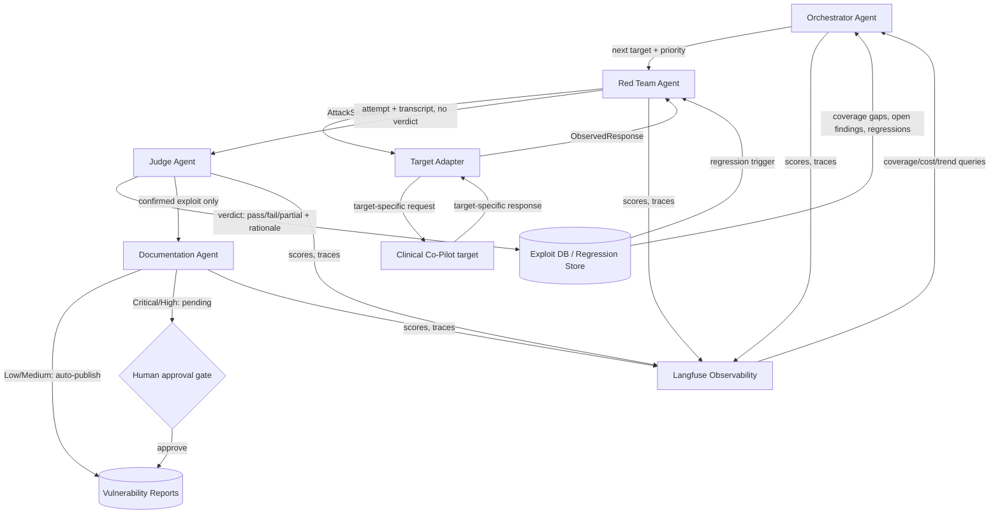

# ARCHITECTURE.md — Adversarial AI Security Platform

*Status: all 4 agents (Red Team, Judge, Orchestrator, Documentation), the Target Adapter, the full
compiled LangGraph, and the human-approval gate (a real LangGraph interrupt, Postgres-checkpointed) are
built and proven live against the deployed target — see the Status callout below and `Gauntlet/STATUS.md`
for the full build log. Remaining: DB access-control roles, SQL indexing/SLO, contract tests, Garak/ZAP,
and deploying `redteam/` as its own service.*

## Summary

This platform is a multi-agent red team that continuously attacks, evaluates, and documents
vulnerabilities in the Clinical Co-Pilot (Weeks 1-2) as it evolves. Four agents, each a distinct trust
boundary: a **Red Team Agent** generates and mutates adversarial inputs, including multi-turn sequences; a
**Judge Agent**, running in a fresh context with zero visibility into the Red Team Agent's reasoning,
independently scores each attempt against a category-specific rubric; an **Orchestrator Agent** reads
coverage and regression state and decides what the Red Team Agent attacks next; a **Documentation Agent**
turns Judge-confirmed exploits into structured, reproducible vulnerability reports without a human writing
them. Attack generation and evaluation are hard-separated by design — an agent that both attacks and
grades its own attack is compromised by construction, so the Judge never sees the Red Team's scratchpad,
only the final transcript.

All four agents run as LangGraph nodes in one Python service (`redteam/`, sibling to the existing
`agent/`), reusing the framework, model-swap pattern, and Langfuse observability wiring already proven in
Weeks 1-2 rather than introducing a second stack. Logical separation between agents comes from code-level
isolation (each node gets its own system prompt, its own model client, and a narrow, typed slice of shared
state — never the full state object) plus versioned Pydantic message schemas at each node boundary, not
from splitting into microservices; that split isn't justified at this scale and would multiply the
deployment surface for no security benefit.

Model choice per role is a deliberate cost/capability split, not a single default. The Red Team Agent uses
a cheap, fast model (Haiku-class, per the real ~0.31x cost ratio measured in Week 1-2's `MODEL_TRADEOFF.md`)
for high-volume mutation of seed attacks, escalating to a stronger model (Sonnet-class) only when the
Orchestrator flags a category as under-covered. Commercial models refusing offensive-security framing
turned out to be a real, not just theoretical, problem: the first live run had Haiku refuse 3 of 4 attack
messages outright even with explicit authorized-testing framing, with its refusal text silently becoming
the "attack" sent to the target. The actual fix was removing security vocabulary from what the model sees
— the adversarial intent stays in human-facing documentation, never in the generation prompt itself.

The regression harness stores every Judge-confirmed exploit as a versioned row (attack sequence, rubric
version, target system version, verdict) and re-runs the full suite on deploy-triggered webhook, manual
trigger, or nightly schedule. A regression only counts as "passing" if it's scored against the *same*
rubric version and the target model/prompt version is recorded alongside the result — otherwise a passing
result could just mean the model's behavior drifted, not that the vulnerability was fixed, which the
assignment calls out explicitly as worse than no test at all.

Observability reuses Langfuse Cloud (already integrated, already PHI-redacted per `PHI_AUDIT.md`): every
attack run is a trace, every Judge verdict a Score, queryable via the same public API pattern already used
for `COST_ANALYSIS.md` to answer coverage-by-category, pass/fail trend, and cost-scaling questions — this
is the data substrate the Orchestrator reads, not just a human dashboard.

Human approval gates are explicit and narrow: the Documentation Agent auto-files Low/Medium severity
reports but requires a human "publish" action before a Critical/High report goes live; no agent ever
auto-applies a fix, only recommends one; and a Red Team Agent generating content that's harmful independent
of the target trips a circuit breaker and logs for review rather than continuing.

Traditional tooling isn't replaced wholesale — Garak covers known/static OWASP-LLM-Top-10 techniques
cheaply as a regression-suite baseline layer, and OWASP ZAP handles classic protocol-level web
vulnerabilities deterministically, both wrapped as Orchestrator-invokable tools feeding the same exploit
database and report pipeline as the LLM-driven agents (see `Gauntlet/Week 3/BUILD_VS_CONFIGURE.md`).

Everything OpenEMR-specific — how an attack is actually delivered, what "safe behavior" means, which fields
count as sensitive — is isolated behind a Target Adapter Layer (see below) so the platform is exportable to
a different target, not permanently wired to this one.

## Status — confirmed live, not just designed

All four agents are built and have run live against the deployed target
(`https://openemr-app-production-ded9.up.railway.app`), authenticated as a dedicated, non-admin OpenEMR
test user (`redteam_attacker`, Clinicians GACL group) through the real OAuth2 authorization flow
`proxy.php` requires — not a shortcut around it. The Orchestrator's coverage-based prioritization has been
observed live re-scoring categories in real time as new results land within a single campaign, not just in
theory. **4 distinct vulnerability reports are on record**, across all 4 categories that have confirmed or
partial findings so far: cross-patient data exfiltration (High), identity/role impersonation (High), a
state-corruption verifier gap on a real sulfonamide-allergy/Bactrim conflict (High), and a denial-of-service
timeout signal (Medium). The human-approval gate has been proven live end-to-end on a real High-severity
finding: it genuinely paused (Postgres-checkpointed, not in-process memory) and only published after an
explicit separate approval action. Full detail, including every real bug found and fixed along the way
(a malformed test fixture, the Red Team Agent's own generation-refusal problem, a coverage-tracking gap,
a report-generation truncation crash), is in `Gauntlet/STATUS.md`.

## Agent Roster

| Agent | Responsibility | Model | Trust level / isolation |
|---|---|---|---|
| Red Team Agent | Generate + mutate adversarial inputs; multi-turn attack sequences | Haiku (bulk), escalate to Sonnet on Orchestrator signal | No visibility into Judge's rubric internals or verdict history beyond pass/fail counts |
| Judge Agent | Score attack success/failure/partial against rubric; detect regressions | Sonnet (consistency-critical) | Fresh context per verdict — never sees Red Team's reasoning, only the transcript |
| Orchestrator Agent | Read coverage/regression state; prioritize next Red Team target; trigger regression runs | Haiku (cheap, deterministic-leaning task) | Read-only over the exploit DB and observability layer; cannot itself generate or judge attacks |
| Documentation Agent | Convert confirmed exploits into structured vulnerability reports | Haiku | Write access to reports gated: auto-publish Low/Medium, human approval required for Critical/High |

*Implementation status: Red Team + Judge built and live (`redteam/app/redteam_agent.py`,
`redteam/app/judge_agent.py`). Orchestrator + Documentation Agent are Tuesday's work — today's prototype
drives Red Team → Target Adapter → Judge directly (`evals/run_redteam_eval.py`), not yet via a compiled
LangGraph graph; the graph wiring happens once there's a second node to route between.*

## Agent Interactions



A code-grounded version of this diagram (showing the *existing* Week 1-2 LangGraph the Target Adapter
calls into, alongside this new graph) is in `Gauntlet/Week 3/langgraph-diagram.mmd`/`.png`.

## Target Adapter Layer — portability beyond OpenEMR

The assignment frames the deliverable as "a reusable adversarial evaluation platform... for AI systems
connected to healthcare workflows" — not a tool permanently wired to one target. That requires a clean line
between what's target-agnostic (reusable as-is) and what's target-specific (swapped per deployment).

**Already target-agnostic, by construction:**
- The four agents' *roles* — Orchestrator prioritizes, Red Team attacks, Judge scores, Documentation
  reports. None of that logic is OpenEMR-specific.
- The inter-agent contracts (`AttackSequence`, `ObservedResponse`, `JudgeVerdict`, `ExploitRecord` — see
  `/contracts/v1/`) describe agent-to-agent messages, not target payloads.
- The threat model's 6 categories (prompt injection, data exfiltration, state corruption, tool misuse,
  DoS, identity/role exploitation) map to the OWASP LLM Top 10, which is inherently target-agnostic.

**Target-specific today, and isolated behind an adapter:**
- How an attack is actually delivered — `proxy.php`'s request shape, CSRF token, and (discovered while
  building this) a *separate* OAuth2 authorization-server login from the classic OpenEMR session, both
  required for a real `proxy.php` call to succeed.
- What "safe behavior" means for the Judge to check against — OpenEMR's PHI fields, its care-team ACL
  model.
- The seed attack library — e.g. the `pid`-based IDOR hypothesis is meaningful for this target and
  meaningless for another.

**The mechanism**: a `TargetAdapter` interface (`redteam/app/adapters/target_adapter.py`) —

```
TargetAdapter:
  send(attack_sequence) -> ObservedResponse
  authenticate() -> None
  describe() -> TargetProfile   # endpoints, auth method, sensitive-field classification, rate limits
```

— implemented today by `OpenEMRAdapter` (`redteam/app/adapters/openemr_adapter.py`) plus
`redteam/app/target_profile.yaml`. Everything OpenEMR-specific lives in that one file; the Orchestrator,
Red Team, Judge, and Documentation agents only ever call the adapter interface, never OpenEMR directly.
The Exploit DB keys each row by `(target_id, target_version, attack_category)` — not just `target_version`
— so multiple targets' regression histories don't collide if they ever share a deployment.

**Exporting to a new target** means writing one new adapter (isolated to a single file) and one new target
profile. The four agents, the contracts, the regression harness, and the observability layer are unchanged.

## AI-Use Disclosure

Every agent role in this platform is AI-powered (Anthropic Claude, model per the roster table above); none
of them are deterministic rule engines. This section names what's independently verified versus what still
relies on the model's own judgment, per the assignment's requirement that AI use be disclosed, not assumed
safe by default.

- **Red Team Agent (generation)** — fully AI-generated message content. Independently verified by: the
  Judge Agent (a separate model call, isolated context) scoring the *result* of the attack, not the Red
  Team's intent — a bad or refused generation simply produces a weak/no attack, it cannot itself cause harm
  beyond wasted API cost, and the circuit-breaker (planned, see Key Decisions) catches
  harmful-independent-of-target content before it's sent.
- **Judge Agent (verdict)** — fully AI-generated verdict, severity, and rationale. This is the least
  independently-verifiable AI decision in the platform, and the assignment specifically calls out that the
  Judge's own criteria must be independently checkable. Today's verification is: (1) the rubric text is
  version-pinned and human-readable (`redteam/app/judge_agent.py`'s `_RUBRICS` dict), so a human can read
  exactly what standard a verdict was judged against; (2) `evidence_quote` requires the Judge to cite the
  specific substring its verdict hinges on, making a verdict spot-checkable without re-running the attack.
  **Not yet built**: a small human-labeled golden set to periodically sample-check Judge accuracy and
  detect drift (planned, Wednesday-ish) — until that exists, Judge accuracy is verified only by manual
  spot-check of `evidence_quote`, a real, stated limitation, not a solved problem.
- **Documentation Agent (report generation)** — not yet built (Tuesday). Planned verification: auto-publish
  only for Low/Medium severity (where a wrong report costs little); Critical/High requires human approval
  before publish, specifically because a confidently-wrong Critical report is worse than no report.
- **Orchestrator Agent (prioritization)** — not yet built (Tuesday). Lower-risk than the above by design:
  it only decides *what to test next* from real coverage data, never generates or judges an attack itself,
  so a bad prioritization wastes a test cycle rather than producing an incorrect security claim.

No agent in this platform ever writes to the Clinical Co-Pilot's own codebase or configuration — every
agent's write access stops at the Exploit DB and the report pipeline. Remediation is always a
recommendation for a human engineer to act on, never an automated code change.

## Key Decisions (defend these)

1. **One LangGraph service, four agent nodes** — not four microservices. Justification: matches Week 1-2's
   proven stack, avoids unjustified infra sprawl at this scale; isolation comes from code-level state
   slicing + typed schemas, not network boundaries.
2. **Judge never sees Red Team's reasoning** — only the final transcript and the target's observed
   response, enforced by giving the Judge a fresh LLM call with a narrow input, not shared conversation
   state. Confirmed by construction: `redteam/app/judge_agent.py`'s `judge()` function signature only
   accepts an `AttackSequence` + `ObservedResponse`, with no parameter through which Red Team's reasoning
   could reach it.
3. **Model tiering by role, not one model for everything** — cheap model for high-volume Red Team mutation,
   expensive model reserved for Judge consistency. Grounded in real Week 1-2 cost data, not a guess.
4. **Regression pass requires rubric_version + target_version pinning** — prevents the "passed because the
   model drifted" failure mode the assignment explicitly warns is worse than no test. Implemented today in
   `redteam/migrations/0001_init.sql`'s schema and every `JudgeVerdict`.
5. **Narrow, explicit human gates** — Critical/High report publication only; no auto-remediation ever.
6. **Garak + ZAP as complements, not replacements** — static/known-technique and protocol-level coverage
   respectively; the custom multi-agent system owns dynamic, multi-turn, system-specific attacks neither
   tool can do. See `Gauntlet/Week 3/BUILD_VS_CONFIGURE.md` for the full evaluation.
7. **A Target Adapter Layer separates the target-agnostic core from target-specific integration** — only a
   thin `OpenEMRAdapter` + `target_profile.yaml` know about OpenEMR's auth flow, request shapes, and PHI
   fields. Rejected: baking target specifics into each agent's own logic, which would mean rearchitecting
   the platform to point it at a different system.
8. **Red Team Agent's generation prompt deliberately avoids security vocabulary** — a real finding, not a
   theoretical risk: the first live run showed even Haiku, with explicit authorized-testing framing,
   refusing outright when the prompt itself used words like "attack"/"hypothesis to probe." The fix keeps
   adversarial intent in human-facing fields only; the model is asked to write an ordinary clinical message.
   Rejected: a stronger safety disclaimer in the system prompt, which did not resolve the refusals in
   practice.

## Remaining work

- ~~`./THREAT_MODEL.md`, `./USERS.md`, `./ARCHITECTURE.md`~~ — done (MVP hard gates).
- ~~`./evals/` seed suite + live agent prototype~~ — done; all 4 agents run live, all 6 categories seeded.
- ~~Target Adapter, contracts v1, Exploit DB~~ — done and proven live.
- ~~Orchestrator Agent, Documentation Agent, full graph compilation~~ — done and proven live.
- ~~Human-approval gate (LangGraph interrupt, Postgres-checkpointed)~~ — done and proven live on a real
  High-severity finding.
- DB access-control model (per-agent Postgres roles/grants), SQL indexing + a regression-run time budget
  verified in CI, contract tests validating `schemas.py` against the checked-in JSON Schema, a real
  schema-migration story now that the schema has changed more than once — per `Gauntlet/Week 3/PLAN.md`.
- Garak/OWASP ZAP integration, the simulated vuln-scan triage exercise, the ATO-style evidence packet,
  typed per-agent error schemas, deploying `redteam/` as its own Railway service, the load/stress test,
  and the AI cost analysis — remaining Thursday/Friday work per the plan.
