# W2_ARCHITECTURE.md — Clinical Co-Pilot Week 2: Multimodal Evidence Agent

## TL;DR

- **What's new**: the agent can now (1) ingest a scanned lab PDF or a patient intake form, extract structured
  facts with per-field citations via Claude vision, and persist them into OpenEMR; (2) retrieve grounded
  guideline evidence via hybrid (sparse+dense) search with reranking; (3) route work through a small
  supervisor + 2-worker LangGraph, instead of a single agent loop; (4) block regressions with a 50-case
  boolean-rubric eval gate enforced by a pre-push git hook.
- **What's reused, unchanged**: Week 1's OAuth2 auth-inheritance model, the `agent`/`execute_tools`/`verify`
  loop (now nested as the graph's "finalize" phase), the deterministic (non-LLM) citation verifier, Langfuse
  observability with PHI redaction, and OpenEMR's existing `documents` upload REST endpoint.
- **Three tradeoffs stated up front**:
  1. OpenEMR's FHIR `DocumentReference`/`Binary`/`Observation` services are **read-only** in this codebase —
     we never POST FHIR directly; we write to the native tables those services already project from, and the
     FHIR view updates for free.
  2. We built one new PHP write path (lab results → `procedure_order`/`report`/`result`) because the
     traceability column we needed (`procedure_result.document_id`) already exists but nothing populates it
     via REST. Everything else reuses existing OpenEMR write endpoints.
  3. Claude-vision field extraction can be wrong or overconfident — the schema, not the model's own stated
     confidence, is the safety net: every field carries a citation, and the deterministic verifier (extended,
     not replaced) is what a claim must survive to reach the clinician.

## 1. System Overview

```mermaid
graph TB
    Clinician["Clinician<br/>(browser, logged into OpenEMR)"]

    subgraph existing["EXISTING (Week 1, unchanged)"]
        ChatUI["Co-Pilot Chat Panel"]
        AgentLoop["agent &#8596; execute_tools &#8594; verify<br/>(FHIR read tools + deterministic verifier)"]
        FHIR["FHIR R4 read API<br/>Patient/Encounter/Condition/.../Observation"]
        DocsAPI["Native REST: documents,<br/>allergy, medication"]
    end

    subgraph new["NEW: Week 2 additions"]
        UploadUI["Upload widget<br/>(lab PDF / intake form)"]
        Supervisor["Supervisor node<br/>(routes, logs handoffs)"]
        Extractor["intake-extractor worker<br/>(Claude vision + strict schema)"]
        Retriever["evidence-retriever worker<br/>(hybrid RAG + rerank)"]
        NewPHP["NEW: procedure_order/report/result<br/>insert path (document_id link)"]
        RAGIndex["Guideline corpus<br/>(BM25 + Voyage embeddings)"]
    end

    Clinician <--> ChatUI
    ChatUI --> UploadUI
    ChatUI --> Supervisor
    UploadUI --> Supervisor
    Supervisor -->|extraction needed| Extractor
    Supervisor -->|evidence needed| Retriever
    Supervisor -->|ready| AgentLoop
    Extractor --> DocsAPI
    Extractor --> NewPHP
    Extractor -.->|handoff logged| Supervisor
    Retriever --> RAGIndex
    Retriever -.->|handoff logged| Supervisor
    AgentLoop --> FHIR
    AgentLoop --> ChatUI

    classDef existingStyle fill:#e8e8e8,stroke:#555,color:#000
    classDef newStyle fill:#cfe8ff,stroke:#1a5fa0,color:#000
    class ChatUI,AgentLoop,FHIR,DocsAPI existingStyle
    class UploadUI,Supervisor,Extractor,Retriever,NewPHP,RAGIndex newStyle
```



Week 1's verified loop is not replaced — it's nested as the graph's final phase. The supervisor decides,
turn by turn, whether extraction or evidence retrieval must run *before* that loop synthesizes and verifies
the answer.

## 2. Document Ingestion Flow

`attach_and_extract(patient_id, file_path, doc_type, bearer_token, correlation_id)` — the intake-extractor
worker's core tool (`agent/app/ingestion.py`):

1. **Upload** the raw file via OpenEMR's existing `POST /api/patient/{pid}/document?path={category}`
   (`DocumentService::insertAtPath` → `Document::createDocument`) — no new OpenEMR upload code. Returns a
   `documents.id`/`uuid`.
2. **Dedup check**: query `GET /api/patient/{pid}/document` first and compare `hash` (sha3-512, already
   computed by OpenEMR on every upload but not checked by it) before re-uploading identical bytes.
3. **Rasterize**: PDF pages → PNG images (`pymupdf`) for Claude vision input.
4. **Extract**: forced tool-use call to Claude against a strict Pydantic schema (`LabPdfExtraction` /
   `IntakeFormExtraction`, see §4) — every field carries `{value, confidence, bbox, page}`.
5. **Validate**: Pydantic `.model_validate()`. Raw model output never bypasses this; a field that fails
   validation is dropped, not coerced.
6. **Persist** (see §2.1/§2.2) and **cite**: every persisted fact's citation points back to
   `{source_type: "document", source_id: documents.id, page_or_section: page, field_or_chunk_id: field_name,
   quote_or_value: extracted value}`.

### 2.1 Lab facts → native procedure tables (new write path)

OpenEMR already has the traceability column Week 2 needs — `procedure_result.document_id`
("references documents.id if this result is a document") — but no REST/FHIR write path populates
`procedure_order`/`procedure_report`/`procedure_result` today (only HL7v2 import or GUI order entry). We add
one new insert method (`src/Services/ProcedureService.php`, following its existing query-oriented structure)
that, per extracted test, writes:

- `procedure_order` (patient_id, provider_id, encounter_id, `external_id` = sha256(`document_id` +
  `test_name` + `collection_date`) — the dedup key, checked before insert)
- `procedure_report` (date_report, date_collected)
- `procedure_result` (result_code, result_text, units, `range`, abnormal, result_status, **document_id**)

Because `FhirObservationLaboratoryService`/`ObservationLabService` already read from this exact join chain,
extracted labs become real, chart-visible FHIR `Observation` resources automatically — we never POST FHIR
Observation directly (it's read-only), we just populate what it already projects from.

### 2.2 Intake facts → existing native endpoints (reused, not new)

| Extracted field | Persisted via | Status |
|---|---|---|
| Current medications | `POST /api/patient/{pid}/medication` | Existing endpoint, reused |
| Allergies | `POST /api/patient/{puuid}/allergy` | Existing endpoint, reused |
| Demographics | *(not re-written)* | Extracted + diffed against existing `patient_data` for the answer; patient identity already exists, so this is a comparison, not a new record |
| Chief concern | *(not re-written)* | Surfaced with citation in the answer; no clean single-field home outside an encounter SOAP note — documented limitation, not silently dropped |
| Family history | *(not re-written for MVP)* | `history_data` has **no REST write path today** (confirmed: zero POST routes reference it) and no existing insert service to extend cheaply. Extracted + cited but not persisted to a native table — explicit MVP scope cut, matching the assignment's "feel narrower than the spec" guidance rather than inventing a second new table-write surface in one sprint. |

Every non-persisted field is still schema-validated, cited, and shown to the clinician — "not persisted"
means "not written back into the chart as a discrete record," not "silently dropped."

### 2.3 Schemas (`agent/app/schemas.py`)

- `Citation` (shared, unified contract — see §5): `{source_type, source_id, page_or_section,
  field_or_chunk_id, quote_or_value}`.
- `LabResultField`: `test_name, value, unit, reference_range, collection_date, abnormal_flag, confidence,
  bbox, page, citation`.
- `IntakeFormExtraction`: demographics fields, `chief_concern`, `current_medications[]`, `allergies[]`,
  `family_history[]` — each entry carries `confidence`, `bbox`, `page`, `citation`.
- Validation tests: `agent/eval/test_schemas_unit.py` (acceptance + rejection cases, no network).

## 3. Worker Graph (Supervisor + 2 Workers)

Extends `agent/app/graph.py` — Week 1's `agent ↔ execute_tools → verify → END` subgraph is preserved
unmodified as the "finalize" phase; a new outer routing layer is added above it.

**New state fields**: `pending_document`, `extracted_facts`, `evidence_snippets`, `correlation_id`,
`handoff_log: list[{from, to, reason, timestamp}]`.

**New nodes**:
- `supervisor` — decides one of: extraction needed (a document is pending and unprocessed), evidence
  retrieval needed (the question references guidelines/recommendations and no evidence has been fetched yet
  this turn), or ready to finalize. Every routing decision appends to `handoff_log`.
- `intake_extractor` — calls `ingestion.attach_and_extract`; returns to `supervisor`.
- `evidence_retriever` — calls `rag.retrieve`; returns to `supervisor`.

**Edges**: `entry → supervisor`; `supervisor → intake_extractor | evidence_retriever | agent`;
`intake_extractor → supervisor`; `evidence_retriever → supervisor`; existing `agent ↔ execute_tools → verify
→ END` unchanged.

**Inspectability**: `handoff_log` is returned in the API response (not just internal state) so a grader can
see *why* the supervisor routed where it did, without reading raw model output — directly answering the
"letting the supervisor become a black box" pitfall the assignment calls out.

**Observability parity**: every new node keeps the Week 1 `@observe(capture_input=False,
capture_output=False)` pattern; only counts/names/flags are sent to Langfuse, matching `PHI_AUDIT.md`'s
existing redaction contract — no new PHI surface is introduced by adding nodes.

## 4. Hybrid RAG + Rerank

- **Corpus**: 5-10 public guideline excerpts (e.g., ADA diabetes standards, USPSTF/CDC screening
  recommendations) relevant to the seeded patients' conditions, stored as `agent/data/guidelines/*.md` with
  front-matter (`source`, `section`, `url`). Synthetic/demo-safe — no real PHI, per the assignment's
  HIPAA-minded-development requirement.
- **Indexing** (`agent/app/rag.py`): paragraph/section chunking; dense vectors via Voyage AI
  (`voyage-3-lite`); sparse via `rank_bm25`. At this corpus scale (dozens of chunks), a flat in-memory vector
  array persisted to a local file is sufficient — no new infra/container.
- **Retrieval**: reciprocal-rank-fusion of BM25 top-k and dense top-k → Voyage rerank (`voyage-rerank-2`) on
  the fused set → top-N chunks returned with citations shaped `{source_type: "guideline", source_id,
  page_or_section, field_or_chunk_id: chunk_id, quote_or_value: snippet}`.
- **Why Voyage for both embeddings and rerank, not Cohere**: one vendor/API key instead of two, consistent
  with the existing "thin service calling a small number of external APIs" pattern; Voyage is Anthropic's
  recommended embeddings partner. Documented as a deliberate substitution for the assignment's literal "Cohere
  Rerank or equivalent" wording.

## 5. Citation Contract (unified, with migration note)

Week 2 introduces one unified citation shape used by every source type:

```json
{"source_type": "fhir | document | guideline",
 "source_id": "resource id / documents.id / guideline slug",
 "page_or_section": "date (fhir) / PDF page (document) / section (guideline)",
 "field_or_chunk_id": "field name / chunk id",
 "quote_or_value": "the extracted value or quoted snippet"}
```

**Migration note**: Week 1's `verifier.py` checks claims against a `(resource_type, resource_id)` tuple set.
This is a strict subset of the new shape (`source_type="fhir"`, `source_id=resource_id`,
`page_or_section=date`) — existing FHIR-tool citations are mapped into the new shape at the point they're
built (`tools.py`'s existing `resource_type`/`id`/`date` fields), not replaced. `verifier.py` is extended
(not rewritten) to check the broader set of `(source_type, source_id)` pairs now valid: FHIR tool results
(existing), `extracted_facts` (new, from §2), and `evidence_snippets` (new, from §4). This is a backward-
compatible additive change — no existing citation-producing code path is removed.

**Visual bounding-box overlay** (required, not stretch): the document-preview pane in the widget renders a
highlight box at `{page, bbox}` when a citation from a `document`-sourced claim is clicked, using the
coordinates Claude's vision extraction already returns per field (§2.3).

## 6. Eval Gate (50-Case Golden Set, PR-Blocking)

- **Golden set** (`agent/eval/golden_set.json`, new): 50 cases, each `{id, category, input, expected:
  {schema_valid, citation_present, factually_consistent, safe_refusal, no_phi_in_logs}}`, covering
  extraction, evidence retrieval, citations, refusals, and missing-data behavior — boolean rubrics only, no
  1-10 ratings (per the assignment's explicit "Using llm-as-a-judge without clear rubric" pitfall warning).
- **Runner** (`agent/eval/test_golden_set.py`): parametrized pytest computing each boolean via a plain
  code-level check (schema validation, citation-shape presence, keyword/value match against fixture ground
  truth, explicit refusal-keyword detection, PHI-pattern scan of captured trace output) — the same
  "deterministic, boring code, not a second model call" philosophy as `verifier.py`.
- **Gate script** (`agent/eval/run_eval_gate.py`): computes per-category pass rate, compares against a
  checked-in `agent/eval/baseline_results.json`, fails (non-zero exit) if any category regresses more than 5%
  or drops below its floor.
- **Two-tier testing strategy**:
  - *Always run, no live API* — fixture-based integration tests (`agent/eval/test_ingestion_integration.py`
    etc.) exercise ingestion → extraction → persistence → RAG plumbing against stored fixture PDFs and
    stubbed LLM/VLM responses. Guards against wiring/schema breakage independent of model behavior or API
    cost.
  - *Pre-push gate, real API* — the 50-case golden set runs against the real Anthropic + Voyage APIs, because
    the assignment's hard-gate check ("we will introduce a small regression and confirm your CI gate fails")
    implies catching real behavioral regressions (e.g., a broken verifier, a loosened schema), which stubbed
    responses cannot exercise.
- **Enforcement**: `scripts/install-hooks.sh` installs `.git/hooks/pre-push` to run `run_eval_gate.py` and
  block the push on failure (git hooks aren't repo-tracked, so the install script + README instruction is the
  reproducible path for graders).
- **What's unit-tested vs. integration-tested vs. golden-set-evaluated vs. not tested**, and each test's
  documented failure mode:
  | Layer | Examples | Failure mode guarded against |
  |---|---|---|
  | Unit (offline) | `test_schemas_unit.py`, `test_verifier_unit.py`, `test_phi_redaction_unit.py` | Schema silently accepting malformed data; verifier silently accepting an uncited claim; PHI leaking into telemetry |
  | Integration (stubbed) | `test_ingestion_integration.py`, RAG pipeline tests | Wiring/plumbing breakage (upload→extract→persist→cite) independent of model output quality |
  | Golden set (real API, gated) | `test_golden_set.py` | Behavioral regression in extraction accuracy, citation completeness, refusal safety, PHI-in-logs |
  | Not tested | Voyage/Anthropic API uptime, OpenEMR infra availability | Out of this project's control; covered by `/ready` degraded-status checks instead (§9), not by the eval gate |

## 7. Data Model / Ownership

| Artifact | Authoritative system | Lineage | Access control | Validation |
|---|---|---|---|---|
| Uploaded source document (PDF/image) | OpenEMR `documents` table | Uploaded by intake-extractor via existing REST endpoint | OpenEMR ACL (`patients`/`med`), same as any chart document | MIME/size checks in existing `DocumentService` |
| Extracted lab observation | OpenEMR `procedure_result` (new write path) | `document_id` FK to source document | Same FHIR/API scopes as existing Observation reads | Pydantic schema pre-persist; DB constraints post-persist |
| Extracted intake fact (allergy/medication) | OpenEMR `lists` table (existing) | Persisted via existing REST endpoint, agent-attributed | Existing OpenEMR ACL | Existing OpenEMR validation + Pydantic pre-check |
| Extracted intake fact (demographics/chief concern/family history) | Agent-side only (not persisted, §2.2) | Citation points to source document | Same auth as the chat turn that produced it | Pydantic schema only |
| Guideline chunk | Agent-side corpus file + local index | Static, checked into `agent/data/guidelines/` | Read-only, no PHI, no access control needed | Front-matter presence check at index build time |
| Citation record | Ephemeral, part of each turn's response | Constructed at answer time from the above | Same as the chat turn | Verifier checks it references a real fetched/extracted/retrieved item |

**Data authority is explicit**: OpenEMR native tables are the source of truth for anything persisted; the
agent never caches a second copy it could silently drift from. No silent overwrites — the dedup keys in §2.1
and the hash check in §2 exist specifically to prevent a second ingestion of the same document from creating
a duplicate row instead of a no-op.

## 8. Correlation ID Propagation

Week 1 had no end-to-end correlation ID (Langfuse's internal trace ID wasn't client-visible or propagated to
PHP). Week 2 adds `correlation_id` (UUID, minted once per chat/ingestion request at `proxy.php`/`upload.php`)
threaded through: the FastAPI request → every graph node's Langfuse span attributes → every VLM/retrieval
call → every new OpenEMR write (passed as a request header, logged server-side alongside the existing
`EventAuditLogger` entry). A grader can reconstruct a full Week 2 request — upload → extraction → worker
handoffs → FHIR-visible writes — from the `correlation_id` alone, without needing raw PHI in any log.

## 9. Observability Extensions

- **New spans**: `document_ingestion`, `extraction` (Claude vision call), `evidence_retrieval` (BM25 + dense
  + rerank), `worker_handoff` (supervisor routing decision).
- **New SLOs**: document ingestion p95 < 15s (VLM call dominates); evidence retrieval p95 < 3s.
- **New alerts**: extraction failure rate > 5%; retrieval latency p95 breach; eval regression (>5% drop in any
  golden-set category — same mechanism as the CI gate, surfaced as an alert too so a live regression between
  scheduled eval runs is caught).
- **New /ready checks**: document storage (OpenEMR reachability), local vector index (loaded/present), Voyage
  API reachability — `/ready` returns **degraded**, not a binary down, if any one dependency is unavailable
  but the core FHIR chat flow still works.
- **Dashboard additions**: document ingestion count, extraction field-level pass rate, retrieval hit rate,
  worker routing decision breakdown, eval pass/fail rate per rubric category — added to the existing Langfuse
  Cloud trace/observation explorer (`OBSERVABILITY.md`), no new dashboard tool needed.

## 10. Failure Modes & Incident Response

| Failure | How it shows up in logs | Recovery action |
|---|---|---|
| Document ingestion fails (upload rejected, network error) | `document_ingestion` span status=error, correlation_id present | Retry once; if persistent, check OpenEMR `/api/patient/{pid}/document` reachability and auth token validity |
| Extraction schema violation (VLM output fails Pydantic validation) | Field-level validation failure logged with field name only (no raw value) | Field is dropped, not invented; clinician sees "could not extract X" rather than a wrong value; review prompt/schema if rate rises |
| RAG retrieval returns zero results | `evidence_retrieval` span, hit_count=0 | Agent must state "no guideline evidence found" (verifier-enforced, same fail-closed pattern as empty FHIR results in Week 1) rather than fabricate guidance |
| Supervisor routing error (infinite loop / no valid route) | `worker_handoff` span shows repeated identical routing decision | Hard cap on handoff count per turn (fails closed to `verify` with whatever's gathered, same fail-safe pattern as Week 1's `route_after_agent`) |

## 11. Backup & Recovery

- **Eval golden set**: checked into the repo (`agent/eval/golden_set.json`, `baseline_results.json`) — fully
  reproducible from git alone, not dependent on any database. RPO: 0 (git history). RTO: immediate (checkout).
- **Extracted documents/FHIR-visible records**: inherit OpenEMR's existing MySQL/filesystem backup posture
  (unchanged by Week 2) — no new backup mechanism introduced or required.
- **Guideline corpus + local vector index**: checked into `agent/data/guidelines/`; the index file itself is
  a build artifact (regenerable from the checked-in corpus in seconds), not something that needs its own
  backup.

## 12. Risks and Tradeoffs

1. **New PHP write path for lab results** (§2.1) is the single highest-effort, highest-risk item in this
   sprint — new insert logic in OpenEMR core, not just agent-side Python. Mitigated by strict scope (one
   method, reusing the existing FK chain and dedup pattern already present on `procedure_order.external_id`)
   and the manual smoke test in the plan's verification section.
2. **Claude-vision bounding boxes are approximate**, not pixel-perfect ground truth. This is disclosed
   explicitly rather than presented as precise OCR — the "vision extraction without invention" hard problem is
   addressed by making low-confidence/unlocated fields visibly flagged, not by pretending bbox accuracy is
   higher than it is.
3. **Small guideline corpus** (5-10 documents) — sufficient to demonstrate a working hybrid retriever per the
   assignment's explicit "reliable hybrid retriever, not a full platform" framing, not a comprehensive
   clinical knowledge base.
4. **Voyage over Cohere** for reranking — a deliberate vendor-consolidation substitution from the assignment's
   literal wording, justified in §4.
5. **Family history and chief concern are not persisted to native OpenEMR tables** (§2.2) — an explicit MVP
   scope cut (no REST write path exists for `history_data` today, and building a second new native-table
   write path in the same sprint as the lab-results path was judged not worth the added risk).

## 13. Deliberately Out of Scope for MVP

Per the assignment's own "Common Pitfalls" and stretch-goal framing, the following are extension work, not
MVP: a critic agent that rejects uncited claims (extension deliverable, not core requirement 1-7); a third
document type (referral fax/medication list); a lab trend chart widget; contextual retrieval improvements
(better chunking, query rewriting, domain-specific filters); GitLab-hosted CI runner integration (a local
pre-push hook satisfies the PR-blocking requirement without assuming CI infrastructure availability).
